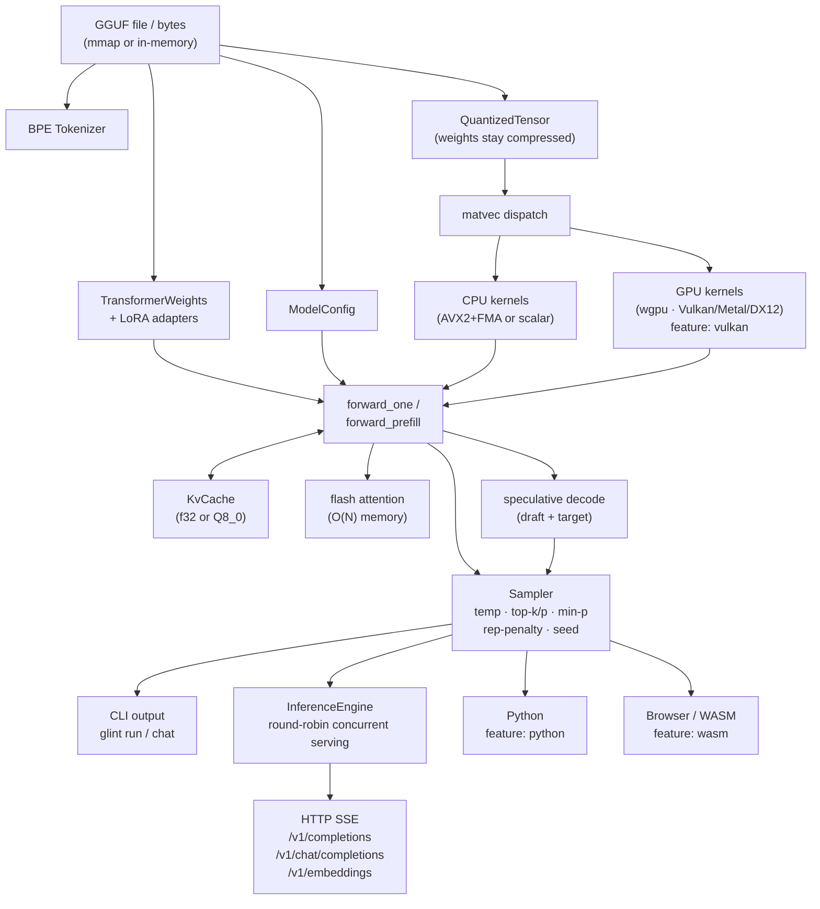

# <div align="center">Glint</div>

<div align="center">
  

  <p><strong>A high-performance LLM inference engine built from scratch in Rust.</strong></p>

  <p>
    Glint loads GGUF models, runs the full transformer forward pass, and serves an
    OpenAI-compatible HTTP API without depending on PyTorch, ONNX, or any other ML framework.
  </p>

  <p>
    
    
    
  </p>
</div>

## Why Glint?

Glint is a focused inference engine for GGUF-based LLaMA-family models. It is designed to be small, understandable, and fast on CPU while still covering the pieces that make a local inference stack practical:

- zero-copy GGUF loading with memory-mapped I/O
- quantized execution with SIMD kernels and Rayon parallelism
- KV-cache backed autoregressive generation
- built-in tokenizer and chat template detection
- OpenAI-compatible HTTP endpoints with SSE streaming

## Feature Overview

| Area | What you get |
| --- | --- |
| Inference | Full LLaMA-family transformer: RMSNorm, RoPE, SwiGLU, grouped-query attention, flash attention, batched prefill |
| Generation | Greedy, sampling (temperature/top-k/top-p/min-p/repetition-penalty/seed), streaming, speculative decoding |
| Quantization | Q8_0, Q4_0, Q4_K, Q5_K, Q6_K, Q2_K, Q3_K, IQ4_NL — weights stay compressed in memory |
| Performance | AVX2+FMA kernels, scalar fallback, Rayon row-parallel matvec, optional GPU backend (wgpu/Vulkan/Metal/DX12) |
| KV Cache | f32 and Q8_0-quantized cache variants; `KvStore` trait abstraction |
| LoRA | Load and apply LoRA adapters at inference time via `--lora` |
| Server | OpenAI-compatible `/v1/completions`, `/v1/chat/completions`, `/v1/embeddings`, `GET /v1/metrics`, SSE streaming, round-robin concurrent serving |
| CLI | `run`, `chat`, `serve`, `inspect`, `generate`, `pull` (HuggingFace Hub download) |
| Bindings | Python (`pyo3`), browser WASM (`wasm-bindgen`), native CLI |

## Build Profiles

CI validates these build surfaces on every push and pull request:

| Surface | Command |
| --- | --- |
| Core CLI + server | `cargo build --release` |
| GPU backend | `cargo check --features vulkan` |
| Browser / WASM | `cargo check --no-default-features --features wasm` + `wasm-pack build --target web --no-default-features --features wasm` |
| Python bindings | `cargo check --features python` |

## Highlights

### Inference

- Full LLaMA-family transformer implementation in Rust
- KV-cache for efficient per-token generation without recomputing prior context
- Greedy decoding and configurable sampling with temperature, top-k, top-p, repetition penalty, and seeding

### Quantization

- Five commonly used GGUF quantization formats: `Q8_0`, `Q4_0`, `Q4_K`, `Q5_K`, `Q6_K`
- SIMD kernels for all supported formats on AVX2+FMA systems
- Compressed weights stay compressed in memory
- Example footprint: a 135M-parameter `Q8_0` model is about 140 MB in memory versus about 540 MB dequantized

### Server

- OpenAI-style completions and chat completions APIs
- Streaming responses via Server-Sent Events
- CORS enabled for browser clients
- `/health` endpoint for readiness checks and simple orchestration

### Model Loading

- Zero-copy GGUF parser using `memmap2`
- Tokenizer loaded directly from GGUF vocabulary
- Chat template detection for ChatML, Llama 3, Mistral, Zephyr, Gemma, and a generic fallback

### LoRA Adapters

- Load low-rank adapters from a `.gguf` file at inference time
- Applied to attention and FFN projections with `alpha/rank` scaling
- `glint run --lora adapter.gguf -f base.gguf -p "Hello" -m 100`

### Speculative Decoding

- Draft model generates k tokens; target verifies in a single batched pass
- Transparent to callers — enabled via `--draft-model` and `--lookahead` flags
- Speeds up generation with minimal accuracy loss

### GPU Acceleration (optional, `--features vulkan`)

- wgpu compute backend: Vulkan on Linux/Windows, Metal on macOS, DX12 on Windows
- WGSL shaders for matvec (Q4_0, Q8_0, f32), RMSNorm, RoPE, softmax, attention, SiLU/mul, add
- Select at runtime with `--gpu`

### Browser / WASM

- `wasm-pack build --target web --no-default-features --features wasm`
- `GlintModel` JS class: `new GlintModel(bytes)`, `.generate()`, `.generate_streaming(callback)`
- Demo in `demo/index.html` — drag-drop a `.gguf` and generate in-browser, zero server

### Python Bindings (optional, `--features python`)

- `import glint; m = glint.GlintLLM("model.gguf"); m.generate("Hello", 64)`
- PyO3 integration with `maturin` for seamless packaging

### Model Pull

- `glint pull Qwen/Qwen2-0.5B-Instruct-GGUF Qwen2-0.5B-Instruct-Q4_K_M.gguf`
- Downloads from HuggingFace Hub with a progress bar
- Saves to `~/.cache/glint/models/` for future use

## Quick Start

```bash
git clone https://github.com/HamadAndrabi/glint
cd glint
cargo build --release
```

## CLI Usage

### Generate text

```bash
glint run -f model.Q4_K_M.gguf -p "The future of AI is" -m 100
```

Sampling example:

```bash
glint run -f model.gguf -p "Once upon a time" -m 200 \
  --temperature 0.8 --top-k 40 --top-p 0.95 --repeat-penalty 1.1
```

With LoRA adapter:

```bash
glint run -f base.gguf --lora adapter.gguf -p "Hello" -m 100
```

With speculative decoding:

```bash
glint run -f target.gguf --draft-model draft.gguf --lookahead 4 -p "Once" -m 200
```

Reproducible sampling (fixed seed):

```bash
glint run -f model.gguf -p "Hello" --seed 42 -m 100
```

### Interactive chat

```bash
glint chat -f model.gguf --system "You are a helpful assistant"
```

With custom sampling:

```bash
glint chat -f model.gguf --temperature 0.8 --top-k 40 --top-p 0.95 -m 512
```

### Run the server

```bash
glint serve -f model.Q4_K_M.gguf -p 8080
```

You can also bind to another host:

```bash
glint serve -f model.gguf --host 0.0.0.0 -p 8080
```

### Inspect a model

```bash
glint inspect -f model.gguf --show-metadata --show-tensors
```

## OpenAI-Compatible API

### Chat completion

```bash
curl http://localhost:8080/v1/chat/completions \
  -H "Content-Type: application/json" \
  -d '{
    "model": "model",
    "messages": [{"role": "user", "content": "Hello!"}],
    "max_tokens": 50,
    "temperature": 0.7
  }'
```

### Streaming completion

```bash
curl http://localhost:8080/v1/completions \
  -H "Content-Type: application/json" \
  -d '{
    "model": "model",
    "prompt": "The meaning of life is",
    "max_tokens": 100,
    "stream": true
  }'
```

### Embeddings (mean-pooled hidden states)

```bash
curl http://localhost:8080/v1/embeddings \
  -H "Content-Type: application/json" \
  -d '{"model": "model", "input": "Hello world"}'
```

### Metrics (request count, token count, latency)

```bash
curl http://localhost:8080/v1/metrics
```

### Health check

```bash
curl http://localhost:8080/health
```

## Benchmarks

Matvec throughput at `4096 x 4096` (Llama 3 8B scale), AVX2+FMA, Rayon:

| Format | Throughput | Time |
| --- | --- | --- |
| `Q4_0` | 24.4 Gelem/s | 687 us |
| `Q8_0` | 22.7 Gelem/s | 739 us |
| `Q4_K` | 20.8 Gelem/s | 808 us |
| `Q6_K` | 18.7 Gelem/s | 899 us |
| `Q5_K` | 17.0 Gelem/s | 984 us |

Run the benchmark suite with:

```bash
cargo bench --bench matvec
```

## Architecture



## Project Structure

```text
src/
  main.rs              CLI entry point (inspect, run, chat, serve, generate, pull)
  lib.rs               Crate root; feature-gates server/python/wasm modules
  error.rs             GlintError
  python.rs            PyO3 bindings (feature: python)
  wasm.rs              wasm-bindgen bindings (feature: wasm)
  model/
    gguf.rs            GGUF binary parser (mmap + in-memory)
    config.rs          Model hyperparameters from metadata
    tokenizer.rs       BPE tokenizer
    chat_template.rs   Chat template detection and rendering
    lora.rs            LoRA adapter loading and application
    pull.rs            HuggingFace Hub download (feature: server)
  tensor/
    tensor.rs          Contiguous f32 tensor
    ops.rs             RMSNorm, RoPE, matmul, softmax, SiLU
    flash.rs           Flash attention (O(N) memory, single-query)
    quantized.rs       Quantized tensor storage and block-wise matvec
    simd.rs            AVX2+FMA kernels (x86_64 + rayon)
    dequantize.rs      Scalar dequantization helpers
  transformer/
    weights.rs         Weight loading from GGUF
    forward.rs         Forward pass and generation loops
    speculative.rs     Speculative decoding (draft/target verification)
  cache/               KvCache (f32), KvCacheQ8, KvStore trait
  sampling/            Temperature, top-k, top-p, min-p, rep-penalty, seeded RNG
  server/              (feature: server)
    mod.rs             Axum router setup and CORS
    engine.rs          Round-robin concurrent inference engine
    routes.rs          /health, /v1/models, /v1/metrics, completions, chat, embeddings
    types.rs           OpenAI-compatible request/response shapes
    state.rs           AppState (Arc-wrapped model + config + metrics)
  backend/             (feature: vulkan)
    mod.rs             GpuBackend trait / dispatch stub
    gpu.rs             wgpu Vulkan/Metal/DX12 backend
    pipeline.rs        GPU pipeline management
    shaders/           WGSL compute shaders (12 kernels)
demo/
  index.html           Browser demo UI (drag-drop model, streaming output)
  worker.js            Web Worker running WASM inference off main thread
```

## Testing

The library test suite currently covers tokenizer behavior, GGUF parsing, quantization paths, tensor ops, sampling, KV-cache handling, and transformer forward logic.

```bash
cargo test --lib
```

Current status: **108** tests passing.

## License

MIT. See [LICENSE](LICENSE).
